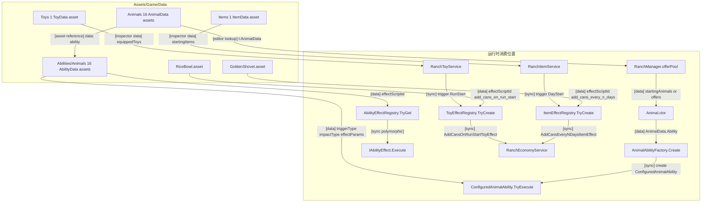

# 项目脚本调用关系与乙方说明

生成日期：2026-05-21

适用范围：本文基于 `Assets/Game/Scripts` 目录下当前可见的 C# 源码，以及 `Assets/Game/Data` 目录下当前可见的 `.asset` 数据文件分析。不包含 Unity 场景文件、Prefab、Inspector 实际绑定值、Unity Script Execution Order 设置或运行时真实对象层级。

## 给乙方看的直白说明

这个项目的核心逻辑可以理解成一条主线：

1. 游戏开始时，`RanchManager` 先启动。
2. `RanchManager` 找到场景里的牧场地图 `RanchMap`。
3. `RanchMap` 再根据每个场景地块上的 `SceneGridCellMarker` 坐标，把地块绑定成一个可操作的格子 `MapCell`。
4. 地图准备好后，`RanchManager` 创建几个服务类，分别负责动物、金钱罐头、每日结算、动物选项、道具和玩具。
5. UI 不直接改地图和数据，而是监听 `RanchManager.StateChanged` 事件。只要状态变化，UI 就刷新。
6. 玩家点地块时，`MapCell` 通知 `RanchManager` 当前选中了哪个格子。
7. 玩家点“结算/下一天”按钮时，UI 调用 `RanchManager.NextDay()`，然后进入每日结算、能力触发、收益计算、动物候选刷新等流程。
8. 动物能力不是写死在管理器里，而是通过 `AbilityData.EffectScriptId` 找到对应的能力效果类执行。

换句话说：

`RanchManager` 是总调度；`RanchMap` 是地图；`MapCell` 是单个格子；`AnimalService` 管动物；`SettlementService` 管结算和能力触发；UI 只负责显示和把按钮点击传回 `RanchManager`。

## 重要边界

以下内容不能从源码或当前 Data 文件中确定：

- 场景里到底放了几个 `RanchManager`、`RanchMap`、UI 控制器。
- Inspector 里实际是否绑定了 `ranchMap`、`animalViewPrefab`、按钮、文本、图片、卡片模板。
- `Assets/Game/Data` 之外是否还有其他未纳入本次分析的 ScriptableObject 配置。
- 场景或 Prefab 的 Inspector 字段实际引用了哪些 `Assets/Game/Data` 资产。
- Unity 的 Script Execution Order 是否有自定义设置。
- Prefab 上是否提前挂好了 `MapCell`、`AnimalView`、`BobMotion` 等组件。

因此，本文只画源码中确定存在的调用关系；不把“Unity 常见做法”当成项目事实。

## 主入口与执行入口

### 运行时主入口

| 脚本 | 入口 | 调用类型 | 是否主初始化 | 依赖来源 |
|---|---|---|---|---|
| `RanchManager` | `Start()` | `[unity lifecycle]` | 是 | Inspector 字段、场景对象、Editor 加载的资产列表 |
| `RanchManager` | `Initialize(...)` | `[sync public]` | 是，可被外部手动初始化 | `RanchMap`、起始动物、Sprite、场景地块 |
| `RanchMap` | `Initialize(...)` | `[sync public]` | 地图初始化 | `SpriteRenderer`、`SceneGridCellMarker`、`AnimalView` Prefab |
| `MapCell` | `Initialize(...)` | `[sync public]` | 单格初始化 | `RanchMap` 调用传入 |
| `RanchUIController` | `Start()` / `Initialize(...)` | `[unity lifecycle]` / `[sync public]` | UI 初始化 | Inspector 或 `FindObjectOfType<RanchManager>` |

### UI 与输入入口

| 脚本 | 入口 | 调用类型 | 作用 |
|---|---|---|---|
| `MapCell` | `OnMouseDown()` | `[input callback]` | 玩家点击地块后选择格子 |
| `RanchHUD` | `nextDayButton.onClick` | `[ui callback]` | 点击结算或下一天 |
| `AnimalOfferPanel` | 动物卡片按钮 | `[ui callback]` | 选择一个动物候选 |
| `AnimalOfferPanel` | `visibilityToggle.onValueChanged` | `[ui callback]` | 展开或收起候选动物面板 |
| `AnimalRemoveButtonPanel` | `removeButton.onClick` | `[ui callback]` | 花罐头移除当前动物 |
| `RanchTestController` | 多个测试按钮 | `[ui callback]` | 进入测试、退出测试、设置动物、删除动物、重置、切换随机开关 |
| `RanchUIController` | `Update()` | `[input callback]` | 点击空白区域时清空动物详情选择 |

### 协程入口

| 脚本 | 协程 | 启动位置 | 作用 |
|---|---|---|---|
| `AnimalDetailPanel` | `SlideTo(Vector2 target, bool visible)` | `SetVisible()` | 动物详情面板滑入滑出 |
| `ToyPanelController` | `RefreshNextFrame()` | `Start()` | 下一帧再刷新一次玩具栏 |

### 编辑器入口

| 脚本 | 入口 | 调用类型 | 作用 |
|---|---|---|---|
| `SceneGridTools` | `Tools/Game/Assign Scene Grid Coords From Position` | `[editor]` | 根据地块位置给 `SceneGridCellMarker.gridCoords` 赋值 |
| `AnimalAssetTools` | `Tools/Game/Fix Animal Asset Object Names` | `[editor]` | 修正 `AnimalData` 资产对象名 |

源码中未发现 `async` / `await` 方法入口。

## 脚本职责分层

### Runtime Entry / Manager 层

- `RanchManager`
  - 直接依赖：`RanchMap`、`RanchGameState`、`RanchEconomyService`、`RanchAnimalService`、`RanchOfferService`、`RanchSettlementService`、`RanchItemService`、`RanchToyService`。
  - 读取 Inspector 字段：`mapWidth`、`mapHeight`、`day`、`money`、`cans`、`removeAnimalCansCost`、`ranchMap`、`offerRoller`、`animalViewPrefab`、`fallbackAnimalSprite`、`startingItems`、`equippedToys` 等。
  - 发出事件：`StateChanged`、`OnPreyAttempt`、`OnPreyProtected`、`OnPreySuccess`、`OnPreyFailed`、`OnAnimalPreyed`、`OnAnimalRemoved`、`OnAnimalSold`、`OnAnimalGrown`、`OnAnimalTransformed`、`OnAnimalCooldownReduced`。
  - 运行时查找：`GetComponent<AnimalOfferRoller>()`、`RanchSceneBinder.ResolveMap()`、`RanchSceneBinder.FindSceneTileRenderers()`。

### Controller / System 层

- `RanchAnimalService`
  - 管理 `animals:List<Animal>`。
  - 调用 `RanchMap.TryMoveAnimal`、`RanchMap.TrySwapAnimals`、`RanchMap.TryRemoveAnimal`、`MapCell.TryPlaceAnimal`、`MapCell.RemoveAnimal`。
  - 移动动物后通过构造注入的 `Action<Animal>` 回调 `RanchManager.ResolveMovedAbility`。

- `RanchSettlementService`
  - 管每日结算、能力触发和结算报告。
  - 扫描 `RanchMap.GetCellsInScanOrder()`。
  - 调用 `animal.Ability.TryExecute(new AnimalAbilityContext(...), triggerType)`。
  - 写入 `RanchEconomyService`。
  - 缓存 `settlementAnimalReports:List` 和 `settlementReportByAnimal:Dictionary`。

- `RanchOfferService`
  - 缓存 `currentOffers:List<AnimalData>`。
  - 调用 `AnimalOfferRoller.Roll()` 或自己从 `offerPool` 随机取候选。
  - 选择候选后调用 `RanchAnimalService.TryAddAnimalToRandomEmptyCell()`。

- `RanchItemService`
  - 缓存 `items:List<ItemRuntimeState>`。
  - 通过 `ItemEffectRegistry.TryCreate(effectScriptId)` 创建道具效果。

- `RanchToyService`
  - 缓存 `equippedToys:List<ToyData>`。
  - 通过 `ToyEffectRegistry.TryCreate(effectScriptId)` 创建玩具效果。

### Map / Grid / Scene Binding 层

- `RanchMap`
  - 缓存 `cells:Dictionary<Vector2Int, MapCell>`。
  - 读取 `SceneGridCellMarker.GridCoords`。
  - 检查坐标是否越界、是否重复。
  - 获取或添加 `MapCell`：`tile.GetComponent<MapCell>() ?? tile.gameObject.AddComponent<MapCell>()`。

- `MapCell`
  - 缓存 `Coords`、`Animal`。
  - 点击时调用 `RanchManager.SelectCell(this)`。
  - 放置或移除动物时刷新 `AnimalView`。
  - 缺少 `AnimalView` 时可通过 `animalViewPrefab` 运行时 `Instantiate`。

- `RanchTileSystem`
  - 缓存 `visualByType:Dictionary<RanchTileType, TileSpriteBinding>`。
  - 缓存 `typeByCoords:Dictionary<Vector2Int, RanchTileType>`。
  - 将地块类型应用到 `MapCell.SetTileSprite(...)`。

- `RanchSceneBinder`
  - `ResolveMap` 使用 `Object.FindObjectOfType<RanchMap>()`。
  - `FindSceneTileRenderers` 使用 `Object.FindObjectsOfType<SceneGridCellMarker>()`，再取每个 marker 的 `SpriteRenderer`。

### Data / Config / ScriptableObject 层

- `AnimalData`
  - `ScriptableObject`，保存动物 id、名称、家族、稀有度、基础收益、能力、图标等。

- `AbilityData`
  - `ScriptableObject`，保存能力 id、触发类型、效果类型、效果脚本 id、参数和子能力。

- `ItemData`
  - `ScriptableObject`，保存道具 id、名称、图标、触发类型、效果脚本 id、参数等。

- `ToyData`
  - `ScriptableObject`，保存玩具 id、名称、图标、触发类型、效果脚本 id、参数等。

### View / Renderer / UI 层

- `RanchUIController`
  - 作为 UI 总入口。
  - 订阅 `RanchManager.StateChanged`。
  - 刷新 HUD、动物候选面板、动物详情面板、移除按钮面板。

- `RanchHUD`
  - 显示天数、金钱、罐头、选中格子文本、结算报告。
  - 绑定下一天按钮到 `RanchManager.NextDay`。

- `AnimalOfferPanel`
  - 根据 `CurrentOffers` 生成动物候选卡片。
  - 卡片按钮点击后把 index 传回 `RanchUIController.OnOfferSelected`。

- `AnimalDetailPanel`
  - 显示当前选中动物详情。
  - 使用协程做滑入滑出。

- `AnimalRemoveButtonPanel`
  - 根据当前选中格子显示移除按钮。
  - 点击后调用 `RanchManager.TryRemoveAnimalWithCans(targetAnimal)`。

- `ItemPanelController` / `ToyPanelController`
  - 读取 `RanchManager.CurrentItemIds` / `CurrentToyIds`。
  - 根据 id 再查 icon 并刷新槽位图片。

### Ability / Item / Toy 效果层

- `ConfiguredAnimalAbility`
  - 根据 `AbilityData.TriggerType` 判断是否触发。
  - 根据冷却、触发次数、概率判断是否执行。
  - 通过 `AbilityEffectRegistry` 找到具体 `IAbilityEffect`。

- `AbilityTargetResolver`
  - 根据 `AbilityData.ImpactType` 和 `EffectParams.target/targetFamily` 找目标动物。

- `AbilityEffectRegistry`
  - 用字符串 key 映射具体能力效果类。
  - 如果 `EffectScriptId` 不匹配 registry key，能力不会执行。

- `ItemEffectRegistry` / `ToyEffectRegistry`
  - 用字符串 key 创建道具或玩具效果类。

## Data 文件夹内容分析

### 目录结构与资产数量

`Assets/Game/Data` 当前分成四类配置：

| 目录 | 当前资产 | 对应脚本类型 | 作用 |
|---|---:|---|---|
| `Assets/Game/Data/Animals` | 16 个动物 `.asset` | `AnimalData` | 定义动物 id、名称、家族、稀有度、基础收益、能力引用、图标 |
| `Assets/Game/Data/Abilities/Animals` | 16 个动物能力 `.asset` | `AbilityData` | 定义触发时机、影响范围、效果脚本 id、冷却、成长/生成目标等 |
| `Assets/Game/Data/Items` | 1 个道具 `.asset` | `ItemData` | 定义道具触发时机和道具效果脚本 id |
| `Assets/Game/Data/Toys` | 1 个玩具 `.asset` | `ToyData` | 定义玩具触发时机和玩具效果脚本 id |

直白解释：`Data` 文件夹就是“策划配置表”。脚本负责执行逻辑，Data 资产负责告诉脚本“有哪些动物、动物带哪个能力、能力什么时候触发、触发后调用哪段代码”。

### 动物资产清单

| 动物资产 | id | 显示名 | 家族 | 稀有度 | 基础收益 | 绑定能力 |
|---|---|---|---|---:|---:|---|
| `raccoon.asset` | `Raccoon` | 浣熊 | `Carnivora` | 0 | -1 | `RaccoonAbility.asset` |
| `tiger.asset` | `Tiger` | 老虎 | `Carnivora` | 2 | 3 | `TigerAbility.asset` |
| `alpaca.asset` | `Alpaca` | 羊驼 | `Hoofed` | 2 | 2 | `AlpacaAbility.asset` |
| `boar.asset` | `Boar` | 野猪 | `Hoofed` | 0 | 1 | `BoarAbility.asset` |
| `calf.asset` | `Calf` | 小牛 | `Hoofed` | 0 | 0 | `CalfAbility.asset` |
| `camel.asset` | `Camel` | 骆驼 | `Hoofed` | 0 | 1 | `CamelAbility.asset` |
| `Cow.asset` | `Cow` | 奶牛 | `Hoofed` | 1 | 2 | `CowAbility.asset` |
| `donkey.asset` | `Donkey` | 驴 | `Hoofed` | 0 | 1 | `DonkeyAbility.asset` |
| `gazelle.asset` | `Gazelle` | 瞪羚 | `Hoofed` | 0 | 1 | `GazelleAbility.asset` |
| `goat.asset` | `Goat` | 山羊 | `Hoofed` | 1 | 2 | `GoatAbility.asset` |
| `horse.asset` | `Horse` | 马 | `Hoofed` | 0 | 1 | `HorseAbility.asset` |
| `lamb.asset` | `Lamb` | 羊羔 | `Hoofed` | 0 | 0 | `LambAbility.asset` |
| `musk_ox.asset` | `MuskOx` | 麝牛 | `Hoofed` | 0 | 2 | `MuskOxAbility.asset` |
| `pig.asset` | `Pig` | 猪 | `Hoofed` | 0 | -1 | `PigAbility.asset` |
| `sheep.asset` | `Sheep` | 绵羊 | `Hoofed` | 0 | -1 | `SheepAbility.asset` |
| `water_buffalo.asset` | `WaterBuffalo` | 水牛 | `Hoofed` | 0 | 2 | `WaterBuffaloAbility.asset` |
| `zebra.asset` | `Zebra` | 斑马 | `Hoofed` | 0 | 1 | `ZebraAbility.asset` |

注意：源码中 `RanchManager.RefreshOfferPoolFromConfiguredFamilies()` 在 Editor 下会从 `Assets/Game/Data/Animals` 按家族加载动物。当前默认家族过滤字段在源码里是 `Hoofed` 和 `Carnivora`，所以这 16 个动物都属于可被加载的家族范围；但运行时场景里实际是否使用这批资产，还要看 `RanchManager` 的 Inspector 序列化结果。

### 能力资产清单

| 能力资产 | 触发时机 | 范围 | 效果类型 | 效果脚本 id | 关键参数 | 对应代码 |
|---|---|---|---|---|---|---|
| `RaccoonAbility.asset` | `SettlementPrepare` | `Self` | `CooldownMoney` | `RaccoonAbilityEffect` | `money=8`，初始 CD 3，CD 3；相邻 `Puddle` 时 CD 额外 -1 | `RaccoonAbilityEffect.Execute` |
| `TigerAbility.asset` | `SettlementPrepare` | `Adjacent` | `Prey` | `TigerAbilityEffect` | 每捕食 1 个目标，自身基础收益 +3；目标家族 `Hoofed` | `TigerAbilityEffect.Execute` |
| `AlpacaAbility.asset` | `SettlementPrepare` | `Adjacent` | `ExtraMoneyMultiplier` | `AlpacaAbilityEffect` | 周围动物本次结算额外金币倍率 `money=2` | `AlpacaAbilityEffect.Execute` |
| `BoarAbility.asset` | `SettlementPrepare` | `Adjacent` | `AddMoney` | `BoarAbilityEffect` | `money=2`；50% 概率把相邻 `Pig` 变成 `Boar` | `BoarAbilityEffect.Execute` |
| `CalfAbility.asset` | `SettlementPrepare` | `Self` | `GrowUp` | `CalfAbilityEffect` | 5 天后成长；水牛 40、奶牛 40、麝牛 20 | `CalfAbilityEffect.Execute` |
| `CamelAbility.asset` | `SettlementPrepare` | `Adjacent` | `TriggerAdjacentAbilityOnSand` | `CamelAbilityEffect` | 处于 `Sand` 地块时随机触发相邻动物能力 | `CamelAbilityEffect.Execute` |
| `CowAbility.asset` | `AnimalPreyed` | `Adjacent` | `SpawnCalf` | `CowAbilityEffect` | 相邻水牛/奶牛/麝牛被捕食时生成 `calf` | `CowAbilityEffect.Execute` |
| `DonkeyAbility.asset` | `SettlementPrepare` | `Field` | `AddMoney` | `DonkeyAbilityEffect` | 场上有 `Horse` 或 `Zebra` 时获得 1 金币 | `DonkeyAbilityEffect.Execute` |
| `GazelleAbility.asset` | `SettlementPrepare` | `Up` | `SwapUpAndAddMoney` | `GazelleAbilityEffect` | 与上方动物交换，获得 2 金币 | `GazelleAbilityEffect.Execute` |
| `GoatAbility.asset` | `AnimalRemoved` | `Self` | `Spawn` | `GoatAbilityEffect` | 被移除时生成 `lamb` | `GoatAbilityEffect.Execute` |
| `HorseAbility.asset` | `SettlementPrepare` | `Row` | `MoveAndAddMoney` | `HorseAbilityEffect` | 向右移动到本行最右空位，每格 2 金币 | `HorseAbilityEffect.Execute` |
| `LambAbility.asset` | `SettlementPrepare` | `Self` | `GrowUp` | `LambAbilityEffect` | 5 天后成长；山羊 50、绵羊 30、羊驼 20 | `LambAbilityEffect.Execute` |
| `MuskOxAbility.asset` | `SettlementPrepare` | `Row` | `AddBaseMoneyToRow` | `MuskOxAbilityEffect` | 同行其他 `Hoofed` 基础收益永久 +1 | `MuskOxAbilityEffect.Execute` |
| `PigAbility.asset` | `SettlementPrepare` | `Self` | `SellSelf` | `PigAbilityEffect` | 5 天后自动卖出，获得 12 金币 | `PigAbilityEffect.Execute` |
| `SheepAbility.asset` | `SettlementPrepare` | `Self` | `SellSelf` | `SheepAbilityEffect` | 3 天后自动卖出，获得 7 金币 | `SheepAbilityEffect.Execute` |
| `WaterBuffaloAbility.asset` | `SettlementPrepare` | `Self` | `AddSettlementBaseMoneyOnPuddle` | `WaterBuffaloAbilityEffect` | 在 `Puddle` 上触发时自身基础收益永久 +1 | `WaterBuffaloAbilityEffect.Execute` |
| `ZebraAbility.asset` | `Moved` | `Self` | `AddBaseMoney` | `ZebraAbilityEffect` | 移动触发时自身基础收益永久 +1 | `ZebraAbilityEffect.Execute` |

直白解释：动物能力资产中的 `effectScriptId` 是连接配置和代码的关键字段。比如 `PigAbility.asset` 写的是 `PigAbilityEffect`，运行时 `ConfiguredAnimalAbility` 会拿这个字符串去 `AbilityEffectRegistry` 找代码对象，找到后才会执行。

当前 16 个能力资产的 `effectScriptId` 都能在 `AbilityEffectRegistry` 里找到对应 key。从源码和 Data 文件看，没有发现能力资产引用了未注册的动物能力效果脚本。

### 道具资产

| 资产 | id | 名称 | 触发时机 | 效果脚本 id | 关键参数 | 对应代码 |
|---|---|---|---|---|---|---|
| `GoldenShovel.asset` | `golden_shovel` | 金铲铲 | `triggerType=1`，对应 `ItemTriggerType.DayStart` | `add_cans_every_n_days` | `day=2`，`cans=1` | `AddCansEveryNDaysItemEffect.TryExecute` |

直白解释：金铲铲是一个开局或背包里被 `RanchItemService` 接收的道具。每天开始时，`RanchItemService.Trigger(ItemTriggerType.DayStart, Day)` 会检查它；它每累计 2 次 DayStart 给 1 个罐头。

### 玩具资产

| 资产 | id | 名称 | 触发时机 | 效果脚本 id | 关键参数 | 对应代码 |
|---|---|---|---|---|---|---|
| `RiceBowl.asset` | `rice_bowl` | 大饭盆 | `triggerType=1`，对应 `ToyTriggerType.RunStart` | `add_cans_on_run_start` | `cans=5`，`unique=1` | `AddCansOnRunStartToyEffect.TryExecute` |

直白解释：大饭盆是开局触发的玩具。`RanchManager.Initialize` 创建服务后立刻调用 `TriggerToys(ToyTriggerType.RunStart)`，如果 `equippedToys` 里包含大饭盆，就会开局加 5 个罐头。

### Data 到代码的确定数据流

- `AnimalData.asset -> AnimalData.ability -> AbilityData.asset` `[inspector data / asset reference]`
- `RanchManager.RefreshOfferPoolFromConfiguredFamilies -> AssetDatabase.FindAssets("t:AnimalData", Assets/Game/Data/Animals)` `[editor lookup]`
- `AnimalData -> new Animal(data, coords) -> AnimalAbilityFactory.Create(data)` `[runtime generated]`
- `AbilityData.EffectScriptId -> AbilityEffectRegistry.TryGet(effectScriptId)` `[sync registry lookup]`
- `AbilityData.EffectParams -> IAbilityEffect.Execute(context, abilityData, targets)` `[sync data]`
- `ItemData.EffectScriptId -> ItemEffectRegistry.TryCreate(effectScriptId)` `[sync registry lookup]`
- `ToyData.EffectScriptId -> ToyEffectRegistry.TryCreate(effectScriptId)` `[sync registry lookup]`

### Data 文件夹补充图

### Data 配置风险

| 风险 | 来源 | 影响 |
|---|---|---|
| `effectScriptId` 字符串必须完全匹配 registry | `AbilityData`、`ItemData`、`ToyData` | 不匹配时效果不会执行 |
| 动物能力引用依赖 asset GUID | `AnimalData.ability` | 如果能力资产丢失或引用断开，动物没有能力 |
| Editor 自动加载动物池只在 `#if UNITY_EDITOR` 内 | `RanchManager.RefreshOfferPoolFromConfiguredFamilies` | 打包运行时不能靠 `AssetDatabase` 动态加载，必须依赖已序列化的 `offerPool` 或外部初始化 |
| 成长/生成能力依赖 `animalData` 或 `growUpAnimalData*` | `GoatAbility`、`CowAbility`、`CalfAbility`、`LambAbility` | 目标动物引用缺失时生成或成长失败 |
| 地块类能力依赖地图类型配置 | `RaccoonAbility`、`WaterBuffaloAbility`、`CamelAbility` | 如果 `RanchTileSystem` 没初始化或地块类型没有被设置，相关加成不会生效 |
| `triggerType` 必须和代码触发点一致 | 所有 `AbilityData` / `ItemData` / `ToyData` | 比如 `ZebraAbility` 是 `Moved`，只有动物移动后才会触发 |

## 主要调用链

### 游戏初始化链

- `RanchManager.Start -> RanchManager.InitializeFromScene()` `[unity lifecycle -> sync]`
- `RanchManager.InitializeFromScene -> RanchSceneBinder.ResolveMap(ranchMap)` `[runtime lookup, 参数: assignedMap]`
- `RanchManager.InitializeFromScene -> RanchSceneBinder.FindSceneTileRenderers()` `[runtime lookup, 输出: sceneTiles]`
- `RanchManager.InitializeFromScene -> RanchManager.Initialize(map, startingAnimals, tileSprite, animalSprite, sceneTiles)` `[sync]`
- `RanchManager.Initialize -> RanchMap.Initialize(this, mapWidth, mapHeight, tileSprite, animalSprite, sceneTiles, animalViewPrefab)` `[sync, inspector data]`
- `RanchMap.Initialize -> RanchMap.BindSceneTiles(manager, sceneTiles)` `[sync]`
- `RanchMap.BindSceneTiles -> RanchMap.TryBindWithExplicitCoords(manager, sceneTiles)` `[sync]`
- `RanchMap.TryBindWithExplicitCoords -> SceneGridCellMarker.GridCoords` `[sync, 读取字段: gridCoords]`
- `RanchMap.TryBindWithExplicitCoords -> MapCell.Initialize(manager, coords, tileSprite, animalSprite, true, animalViewPrefab)` `[sync, 参数: coords]`
- `RanchMap.Initialize -> RanchTileSystem.Initialize(this)` `[runtime lookup -> sync]`
- `RanchManager.Initialize -> RanchManager.CreateServices()` `[sync]`
- `RanchManager.Initialize -> RanchManager.TriggerToys(ToyTriggerType.RunStart)` `[sync]`
- `RanchManager.Initialize -> RanchManager.SeedAnimals(startingAnimals)` `[sync]`
- `RanchManager.Initialize -> RanchManager.NotifyStateChanged()` `[event invoke]`

### UI 刷新链

- `RanchUIController.Start -> FindObjectOfType<RanchManager>()` `[runtime lookup]`
- `RanchUIController.Start -> RanchUIController.Initialize(manager)` `[unity lifecycle -> sync]`
- `RanchUIController.Initialize -> RanchHUD.Initialize(manager.NextDay)` `[sync, ui callback bind]`
- `RanchUIController.Initialize -> AnimalOfferPanel.Initialize(OnOfferSelected)` `[sync, callback data]`
- `RanchUIController.Initialize -> AnimalRemoveButtonPanel.Initialize(manager)` `[sync]`
- `RanchUIController.Initialize -> manager.StateChanged += Refresh` `[event subscribe]`
- `RanchManager.NotifyStateChanged -> StateChanged.Invoke()` `[event invoke]`
- `StateChanged -> RanchUIController.Refresh()` `[event callback]`
- `RanchUIController.Refresh -> RanchHUD.Refresh(day, money, cans, selectedText, report, waitingOffer, waitingNextDay)` `[sync, data]`
- `RanchUIController.Refresh -> AnimalOfferPanel.Refresh(CurrentOffers, IsWaitingForOfferSelection)` `[sync, data]`
- `RanchUIController.Refresh -> AnimalDetailPanel.Refresh(selectedAnimal)` `[sync, data]`
- `RanchUIController.Refresh -> AnimalRemoveButtonPanel.Refresh(selectedCell)` `[sync, data]`

### 点击地块链

- `MapCell.OnMouseDown -> MapCell.IsPointerOverUi()` `[input callback -> sync]`
- `MapCell.OnMouseDown -> RanchManager.SelectCell(this)` `[input callback -> sync, 参数: MapCell]`
- `RanchManager.SelectCell -> previousCell.SetSelected(false)` `[sync]`
- `RanchManager.SelectCell -> selectedCell.SetSelected(true)` `[sync]`
- `RanchManager.SelectCell -> NotifyStateChanged()` `[event invoke]`

### 每日结算链

- `RanchHUD.nextDayButton.onClick -> RanchManager.NextDay()` `[ui callback -> sync]`
- `RanchManager.NextDay -> RanchManager.ResolveDailySettlement()` `[sync]`
- `ResolveDailySettlement -> RanchSettlementService.ResolveDailySettlement(ranchMap)` `[sync, 参数: RanchMap]`
- `RanchSettlementService.ResolveDailySettlement -> ResolveAbilitiesByMapScan(ranchMap, "SettlementPrepare")` `[sync]`
- `RanchSettlementService.ResolveDailySettlement -> ResolveAbilitiesByMapScan(ranchMap, "DayStart")` `[sync]`
- `RanchSettlementService.ResolveDailySettlement -> ResolveAbilitiesByMapScan(ranchMap, "DayEnd")` `[sync]`
- `ResolveAbilitiesByMapScan -> ExecuteAbilityWithReport(animal, triggerType)` `[sync]`
- `ExecuteAbilityWithReport -> animal.Ability.TryExecute(new AnimalAbilityContext(manager, animal), triggerType)` `[sync, polymorphic]`
- `ConfiguredAnimalAbility.TryExecute -> AbilityTargetResolver.Resolve(context, config)` `[sync, data: ImpactType/EffectParams]`
- `ConfiguredAnimalAbility.TryExecute -> AbilityEffectRegistry.TryGet(config.EffectScriptId, out effect)` `[sync, registry lookup]`
- `ConfiguredAnimalAbility.TryExecute -> effect.Execute(context, config, targets)` `[sync, polymorphic]`
- `RanchSettlementService.ResolveDailySettlement -> Animal.ResolveBaseMoney(ranchMap)` `[sync, data: Animal]`
- `RanchSettlementService.ResolveDailySettlement -> RanchEconomyService.AddMoney(income)` `[sync, data: income]`
- `RanchManager.NextDay -> RanchOfferService.Roll(Day, 3)` `[sync, 参数: Day/count]`
- `RanchManager.NextDay -> NotifyStateChanged()` `[event invoke]`

### 选择候选动物链

- `AnimalOfferPanel.CreateCard -> button.onClick.AddListener(() => SelectOffer(capturedIndex))` `[ui callback bind]`
- `AnimalOfferPanel.SelectOffer(index -> offerSelected.Invoke(index))` `[event invoke, 参数: index]`
- `RanchUIController.OnOfferSelected(index -> manager.SelectOffer(index))` `[sync]`
- `RanchManager.SelectOffer -> RanchOfferService.SelectOffer(index, animalService)` `[sync]`
- `RanchOfferService.SelectOffer -> RanchAnimalService.TryAddAnimalToRandomEmptyCell(selectedAnimal)` `[sync, data: AnimalData]`
- `RanchAnimalService.TryAddAnimalToRandomEmptyCell -> new Animal(data, cell.Coords)` `[sync, runtime generated]`
- `RanchAnimalService.TryAddAnimalToRandomEmptyCell -> MapCell.TryPlaceAnimal(animal)` `[sync]`

### 能力触发链

- `RanchSettlementService.ExecuteAbilityWithReport -> ConfiguredAnimalAbility.TryExecute(context, triggerType)` `[sync]`
- `ConfiguredAnimalAbility.TryExecute -> AbilityTargetResolver.Resolve(context, config)` `[sync]`
- `ConfiguredAnimalAbility.TryExecute -> AbilityEffectRegistry.TryGet(effectScriptId, out effect)` `[sync]`
- `ConfiguredAnimalAbility.TryExecute -> IAbilityEffect.Execute(context, abilityData, targets)` `[sync polymorphic]`

能力效果中已确认会反向调用 `RanchManager` 的操作包括：

- 加钱：`context.RanchManager.AddMoney(amount)`。
- 移动动物：`context.RanchManager.TryMoveAnimal(...)`。
- 交换动物：`context.RanchManager.TrySwapAnimals(...)`。
- 成长动物：`context.RanchManager.GrowAnimal(...)`。
- 转换动物：`context.RanchManager.TransformAnimal(...)`。
- 设置动物：`context.RanchManager.TrySetAnimalAt(...)`。
- 售卖动物：`context.RanchManager.SellAnimal(...)`。
- 捕食：`context.RanchManager.TryPrey(...)`。
- 手动触发其他动物能力：`context.RanchManager.TryTriggerAnimalAbility(...)`。

## 关键数据流

### 地图数据流

- `Inspector: RanchManager.mapWidth/mapHeight -> RanchManager.Initialize -> RanchMap.Initialize -> RanchMap.width/height`。
- `Scene Object: SceneGridCellMarker.gridCoords -> RanchMap.TryBindWithExplicitCoords -> cells:Dictionary<Vector2Int, MapCell>`。
- `Scene Object: SpriteRenderer tile -> MapCell.Initialize -> tileRenderer/defaultTileLocalScale/defaultColliderSize`。
- `Inspector or runtime: AnimalView prefab -> MapCell.EnsureAnimalView -> Instantiate(animalViewPrefab, transform, false)`。

风险：

- `sceneTiles.Count < width * height` 时，`RanchMap` 会清空 `cells` 并报错。
- `SceneGridCellMarker` 缺失、不完整、重复坐标、越界坐标都会导致地图绑定失败。
- `RanchManager` 在 `RanchMap.Initialize` 失败后仍会继续创建服务，后续动物播种或结算可能面对空地图。

### 动物数据流

- `ScriptableObject: AnimalData -> RanchAnimalService.TryAddAnimalToRandomEmptyCell -> new Animal(data, coords)`。
- `AnimalData.Ability -> AnimalAbilityFactory.Create -> ConfiguredAnimalAbility`。
- `Animal -> MapCell.Animal -> AnimalView.Refresh -> SpriteRenderer.sprite`。
- `AnimalService.animals:List<Animal> -> RanchSettlementService.BeginSettlementReport -> animal.ResetSettlementModifiers()`。

风险：

- `AnimalData.Ability` 为空时，该动物没有运行时能力。
- `AbilityData.EffectScriptId` 与 `AbilityEffectRegistry` key 不匹配时，能力不会执行。

### 结算数据流

- `RanchMap.GetCellsInScanOrder -> cell.Animal -> Animal.ResolveBaseMoney -> income`。
- `income -> RanchEconomyService.AddMoney -> RanchGameState.Money`。
- `settlementAnimalReports:List -> LastReport:string -> RanchHUD.Refresh -> settlementReportText.text`。

风险：

- `ResolveDailySettlement(ranchMap)` 没有对 `ranchMap == null` 做显式保护；当前调用路径中正常初始化应传入 map，但源码本身没有兜底。

### UI 数据流

- `RanchManager.StateChanged -> RanchUIController.Refresh -> RanchHUD/OfferPanel/DetailPanel/RemovePanel`。
- `RanchManager.CurrentItemIds -> ItemPanelController.slotItemIds -> itemImages[i].sprite`。
- `RanchManager.CurrentToyIds -> ToyPanelController.slotToyIds -> toyImages[i].sprite`。
- `RanchManager.SelectedCell -> AnimalDetailPanel.Refresh(selectedAnimal)`。

风险：

- 未提供场景，无法确认所有 UI 字段是否绑定。
- `RanchHUD.RefreshActionButton` 中，如果 `nextDayButtonLabel` 存在但 `nextDayButton` 为空，会访问 `nextDayButton.interactable`，存在空引用风险。

### 道具和玩具数据流

- `Inspector: startingItems:List<ItemData> -> RanchItemService.items:List<ItemRuntimeState>`。
- `ItemData.EffectScriptId -> ItemEffectRegistry.TryCreate -> IItemEffect.TryExecute`。
- `AddCansEveryNDaysItemEffect -> ItemRuntimeState.Tick -> RanchEconomyService.AddCans`。
- `Inspector: equippedToys:List<ToyData> -> RanchToyService.equippedToys:List<ToyData>`。
- `ToyData.EffectScriptId -> ToyEffectRegistry.TryCreate -> IToyEffect.TryExecute`。
- `AddCansOnRunStartToyEffect -> RanchEconomyService.AddCans`。

风险：

- registry 中当前只注册了一个道具效果和一个玩具效果。
- `EffectScriptId` 为空或不匹配时，效果不会执行。

## Mermaid 调用关系图

```mermaid
flowchart TD
    subgraph Entry["入口层"]
        UnityStart["Unity.Start"]
        UnityUpdate["Unity.Update 或 LateUpdate"]
        MouseInput["MapCell.OnMouseDown"]
        UIButton["UI Button 或 Toggle"]
        MenuGrid["MenuItem Assign Scene Grid Coords"]
        MenuAnimal["MenuItem Fix Animal Asset Names"]
    end

    subgraph Manager["Runtime Entry / Manager 层"]
        RM_Start["RanchManager.Start"]
        RM_InitScene["RanchManager.InitializeFromScene"]
        RM_Init["RanchManager.Initialize"]
        RM_CreateServices["RanchManager.CreateServices"]
        RM_NextDay["RanchManager.NextDay"]
        RM_SelectCell["RanchManager.SelectCell"]
        RM_StateChanged["RanchManager.StateChanged"]
        RM_TryPrey["RanchManager.TryPrey"]
        RM_SelectOffer["RanchManager.SelectOffer"]
    end

    subgraph MapLayer["Map / Grid / Scene Binding 层"]
        Binder_Map["RanchSceneBinder.ResolveMap"]
        Binder_Tiles["RanchSceneBinder.FindSceneTileRenderers"]
        RMap_Init["RanchMap.Initialize"]
        RMap_Bind["RanchMap.BindSceneTiles"]
        Marker_Coord["SceneGridCellMarker.GridCoords"]
        CellsDict["RanchMap.cells Dictionary"]
        Cell_Init["MapCell.Initialize"]
        Cell_Place["MapCell.TryPlaceAnimal"]
        Cell_Click["MapCell.OnMouseDown"]
        TileSystem_Init["RanchTileSystem.Initialize"]
    end

    subgraph SystemLayer["Controller / System 层"]
        State_New["RanchGameState"]
        Economy["RanchEconomyService"]
        AnimalService["RanchAnimalService"]
        OfferService["RanchOfferService"]
        Settlement["RanchSettlementService"]
        ItemService["RanchItemService"]
        ToyService["RanchToyService"]
        OfferRoller["AnimalOfferRoller.Roll"]
    end

    subgraph AbilityLayer["Ability / Item / Toy 层"]
        Animal_New["Animal.ctor"]
        AbilityFactory["AnimalAbilityFactory.Create"]
        ConfigAbility["ConfiguredAnimalAbility.TryExecute"]
        AbilityTarget["AbilityTargetResolver.Resolve"]
        AbilityRegistry["AbilityEffectRegistry.TryGet"]
        AbilityEffect["IAbilityEffect.Execute"]
        PreyResolver["PreyTargetResolver.Resolve"]
        ProtectionRuleNode["ProtectionRule.CanProtect"]
        ItemRegistry["ItemEffectRegistry.TryCreate"]
        ItemEffect["IItemEffect.TryExecute"]
        ToyRegistry["ToyEffectRegistry.TryCreate"]
        ToyEffect["IToyEffect.TryExecute"]
    end

    subgraph DataLayer["Data / Config / ScriptableObject 层"]
        InspectorRM["Inspector data RanchManager fields"]
        SceneTiles["Scene Objects SpriteRenderer tiles"]
        SOAnimal["ScriptableObject AnimalData"]
        SOAbility["ScriptableObject AbilityData"]
        SOItem["ScriptableObject ItemData"]
        SOToy["ScriptableObject ToyData"]
        OfferPool["offerPool List AnimalData"]
        CurrentOffers["currentOffers List AnimalData"]
        ItemsList["items List ItemRuntimeState"]
        ToysList["equippedToys List ToyData"]
    end

    subgraph UILayer["View / Renderer / UI 层"]
        UI_Start["RanchUIController.Start"]
        UI_Init["RanchUIController.Initialize"]
        UI_Refresh["RanchUIController.Refresh"]
        HUD_Init["RanchHUD.Initialize"]
        HUD_Refresh["RanchHUD.Refresh"]
        OfferPanel_Init["AnimalOfferPanel.Initialize"]
        OfferPanel_Refresh["AnimalOfferPanel.Refresh"]
        OfferPanel_Select["AnimalOfferPanel.SelectOffer"]
        Detail_Refresh["AnimalDetailPanel.Refresh"]
        Detail_Slide["AnimalDetailPanel.SlideTo coroutine"]
        RemovePanel_Init["AnimalRemoveButtonPanel.Initialize"]
        RemovePanel_Remove["AnimalRemoveButtonPanel.RemoveTargetAnimal"]
        ItemPanel_Refresh["ItemPanelController.Refresh"]
        ToyPanel_Refresh["ToyPanelController.Refresh"]
        AnimalView_Refresh["AnimalView.Refresh"]
    end

    subgraph EditorLayer["Editor Tool 层"]
        GridTool["SceneGridTools.AssignSceneGridCoordsFromPosition"]
        AnimalTool["AnimalAssetTools.FixAnimalAssetObjectNames"]
        AssetDB["UnityEditor.AssetDatabase"]
        SelectionNode["UnityEditor.Selection"]
    end

    UnityStart -->|"[unity lifecycle]"| RM_Start
    RM_Start -->|"[sync]"| RM_InitScene
    RM_InitScene -->|"[runtime lookup] 参数 assignedMap"| Binder_Map
    RM_InitScene -->|"[runtime lookup] 输出 sceneTiles"| Binder_Tiles
    InspectorRM -->|"[inspector data] mapWidth mapHeight prefabs sprites"| RM_Init
    Binder_Map -->|"[data] RanchMap"| RM_Init
    Binder_Tiles -->|"[data] sceneTiles"| RM_Init
    RM_Init -->|"[sync] 参数 mapWidth mapHeight sceneTiles"| RMap_Init
    RMap_Init -->|"[sync] 参数 sceneTiles"| RMap_Bind
    SceneTiles -->|"[scene object data]"| RMap_Bind
    RMap_Bind -->|"[sync] 读取 gridCoords"| Marker_Coord
    Marker_Coord -->|"[data] coords"| CellsDict
    RMap_Bind -->|"[runtime lookup] GetComponent or AddComponent"| Cell_Init
    Cell_Init -->|"[data] coords manager sprite"| CellsDict
    Cell_Init -->|"[sync]"| AnimalView_Refresh
    RMap_Init -->|"[runtime lookup] GetComponent RanchTileSystem"| TileSystem_Init

    RM_Init -->|"[sync]"| RM_CreateServices
    RM_CreateServices -->|"[sync] day money cans"| State_New
    RM_CreateServices -->|"[sync] state"| Economy
    RM_CreateServices -->|"[sync] ranchMap callback ResolveMovedAbility"| AnimalService
    RM_CreateServices -->|"[sync] offerRoller offerPool"| OfferService
    RM_CreateServices -->|"[sync] manager animalService economy"| Settlement
    RM_CreateServices -->|"[sync] startingItems"| ItemService
    RM_CreateServices -->|"[sync] equippedToys"| ToyService

    SOAnimal -->|"[data] startingAnimals"| AnimalService
    AnimalService -->|"[sync] new Animal data coords"| Animal_New
    Animal_New -->|"[sync] AnimalData.Ability"| AbilityFactory
    AbilityFactory -->|"[data] AbilityData"| ConfigAbility
    SOAbility -->|"[data] AbilityData fields"| ConfigAbility
    AnimalService -->|"[sync] animal coords"| Cell_Place
    Cell_Place -->|"[sync] refresh animal view"| AnimalView_Refresh

    UnityStart -->|"[unity lifecycle]"| UI_Start
    UI_Start -->|"[runtime lookup] FindObjectOfType RanchManager"| UI_Init
    UI_Init -->|"[ui callback bind] manager.NextDay"| HUD_Init
    UI_Init -->|"[sync] callback OnOfferSelected"| OfferPanel_Init
    UI_Init -->|"[sync] manager"| RemovePanel_Init
    UI_Init -->|"[event subscribe] Refresh"| RM_StateChanged
    RM_StateChanged -->|"[event invoke]"| UI_Refresh
    RM_StateChanged -->|"[event invoke]"| ItemPanel_Refresh
    RM_StateChanged -->|"[event invoke]"| ToyPanel_Refresh
    UI_Refresh -->|"[sync] data day money cans selection report"| HUD_Refresh
    UI_Refresh -->|"[sync] data currentOffers showFlag"| OfferPanel_Refresh
    UI_Refresh -->|"[sync] data selected animal"| Detail_Refresh
    Detail_Refresh -->|"[coroutine] target visible"| Detail_Slide

    UIButton -->|"[ui callback]"| RM_NextDay
    RM_NextDay -->|"[sync]"| Settlement
    Settlement -->|"[sync] triggerType"| ConfigAbility
    ConfigAbility -->|"[sync] config impactType effectParams"| AbilityTarget
    ConfigAbility -->|"[sync] effectScriptId"| AbilityRegistry
    AbilityRegistry -->|"[sync polymorphic] targets context config"| AbilityEffect
    AbilityEffect -->|"[sync] manager mutations money move grow prey"| RM_TryPrey
    Settlement -->|"[sync] income"| Economy
    RM_NextDay -->|"[sync] count 3"| OfferService
    OfferService -->|"[sync] day count offerPool"| OfferRoller
    OfferRoller -->|"[data] AnimalData offers"| CurrentOffers
    CurrentOffers -->|"[data]"| OfferPanel_Refresh

    UIButton -->|"[ui callback] card index"| OfferPanel_Select
    OfferPanel_Select -->|"[event invoke] index"| RM_SelectOffer
    RM_SelectOffer -->|"[sync] index animalService"| OfferService
    OfferService -->|"[sync] selected AnimalData"| AnimalService

    MouseInput -->|"[input callback]"| Cell_Click
    Cell_Click -->|"[sync] this MapCell"| RM_SelectCell
    RM_SelectCell -->|"[event invoke]"| RM_StateChanged

    RM_TryPrey -->|"[sync] PreyContext"| PreyResolver
    RM_TryPrey -->|"[sync] candidate target"| ProtectionRuleNode
    RM_TryPrey -->|"[sync] remove target"| AnimalService

    ItemService -->|"[sync] effectScriptId"| ItemRegistry
    ItemRegistry -->|"[sync polymorphic] item context"| ItemEffect
    ItemEffect -->|"[sync] economy cans"| Economy
    SOItem -->|"[inspector data] startingItems"| ItemsList
    ItemsList -->|"[data] item ids icons"| ItemPanel_Refresh

    ToyService -->|"[sync] effectScriptId"| ToyRegistry
    ToyRegistry -->|"[sync polymorphic] toy context"| ToyEffect
    ToyEffect -->|"[sync] economy cans"| Economy
    SOToy -->|"[inspector data] equippedToys"| ToysList
    ToysList -->|"[data] toy ids icons"| ToyPanel_Refresh

    UIButton -->|"[ui callback]"| RemovePanel_Remove
    RemovePanel_Remove -->|"[sync] targetAnimal cans cost"| AnimalService

    MenuGrid -->|"[editor]"| GridTool
    GridTool -->|"[editor lookup]"| SelectionNode
    GridTool -->|"[editor writes] gridCoords"| Marker_Coord
    MenuAnimal -->|"[editor]"| AnimalTool
    AnimalTool -->|"[editor lookup and save]"| AssetDB
```

## 给乙方验收时可以这样讲

这批脚本的结构不是“每个按钮自己改数据”，而是“按钮通知总管理器，总管理器改状态，状态变化后 UI 统一刷新”。这种结构的好处是数据源比较集中，结算、动物、地图、UI 的职责比较清楚。

当前最关键的依赖点有三个：

1. 场景地块必须挂 `SceneGridCellMarker`，并且坐标要完整、不能重复、不能越界。
2. `RanchManager` 的 Inspector 配置要完整，尤其是地图、动物视图 Prefab、起始道具、装备玩具、候选动物池相关数据。
3. `AbilityData`、`ItemData`、`ToyData` 里的 `EffectScriptId` 必须和代码 registry 中登记的 key 一致，否则对应能力或效果不会触发。

如果乙方问“为什么某个动物能力不生效”，优先检查：

1. 动物 `AnimalData` 是否绑定了 `AbilityData`。
2. `AbilityData.TriggerType` 是否和当前流程触发点一致，例如 `DayStart`、`DayEnd`、`Moved`。
3. `AbilityData.EffectScriptId` 是否在 `AbilityEffectRegistry` 中注册。
4. 能力参数是否满足目标筛选条件，例如目标范围、目标家族、冷却、概率、触发次数限制。

如果乙方问“为什么 UI 没刷新”，优先检查：

1. 场景里 `RanchUIController` 是否拿到了正确的 `RanchManager`。
2. `RanchUIController` 是否订阅了 `manager.StateChanged`。
3. `RanchManager` 的业务方法结束后是否调用了 `NotifyStateChanged()`。
4. 对应 UI 字段是否在 Inspector 里绑定。

如果乙方问“为什么地图没动物或不能点”，优先检查：

1. 场景里的地块数量是否至少等于 `mapWidth * mapHeight`。
2. 每个有效地块是否有 `SceneGridCellMarker` 和 `SpriteRenderer`。
3. 坐标是否完整且没有重复。
4. 地块上是否有 `BoxCollider2D`，或 `MapCell.Initialize` 是否成功添加/使用了碰撞体。

## 源码层面的主要风险

| 风险 | 位置 | 说明 |
|---|---|---|
| 初始化顺序不可从源码确认 | `RanchManager.Start`、各 UI `Start` | 未提供 Script Execution Order，不能保证谁先执行 |
| 地图绑定失败后仍创建服务 | `RanchManager.Initialize` / `RanchMap.Initialize` | `RanchMap` 报错清空 cells 后，manager 仍继续创建 services |
| HUD 空引用风险 | `RanchHUD.RefreshActionButton` | `nextDayButtonLabel` 有值但 `nextDayButton` 为空时会访问空对象 |
| registry 字符串不匹配 | `AbilityEffectRegistry`、`ItemEffectRegistry`、`ToyEffectRegistry` | 配置里的 `EffectScriptId` 必须严格匹配 |
| Inspector 实际绑定未知 | 所有 `[SerializeField]` 字段 | 源码只能说明“需要绑定”，不能证明场景里已经绑定 |
| 运行时查找依赖场景对象存在 | `FindObjectOfType`、`FindObjectsOfType` | 如果场景对象缺失或重复，源码没有完全兜底 |

## 结论

从源码看，当前项目的主流程是清晰的：

- `RanchManager` 是游戏局内总入口。
- `RanchMap` 负责把场景里的地块变成可查询的格子表。
- `RanchAnimalService` 管动物放置、移动、删除。
- `RanchSettlementService` 管每日结算和动物能力触发。
- `RanchOfferService` 管每日候选动物。
- `RanchItemService` 和 `RanchToyService` 管道具、玩具触发。
- UI 通过事件监听刷新，不直接成为数据源。
- `Assets/Game/Data` 当前提供 16 个动物、16 个动物能力、1 个道具和 1 个玩具；这些资产通过 `ability` 引用和 `effectScriptId` 字符串接入运行时代码。

后续验收时，应重点检查场景绑定、ScriptableObject 配置和 registry 字符串是否一致。这些不是靠源码就能完全确认的，需要在 Unity 编辑器中逐项核对。
